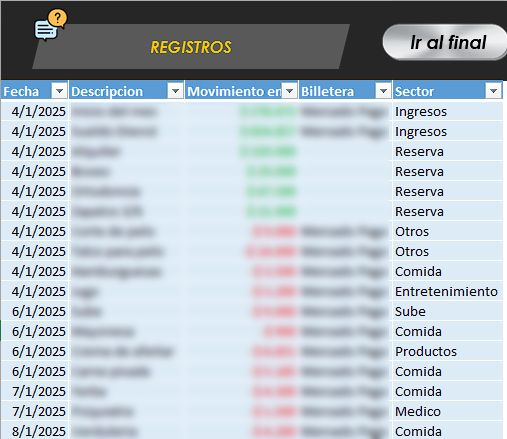
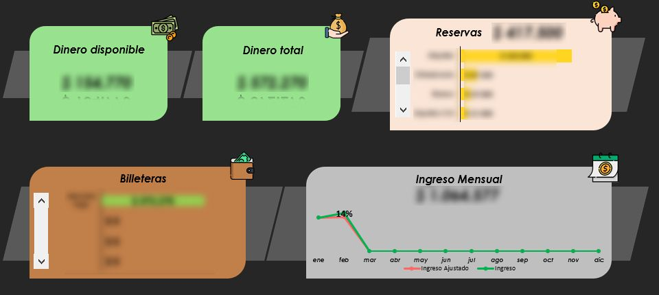
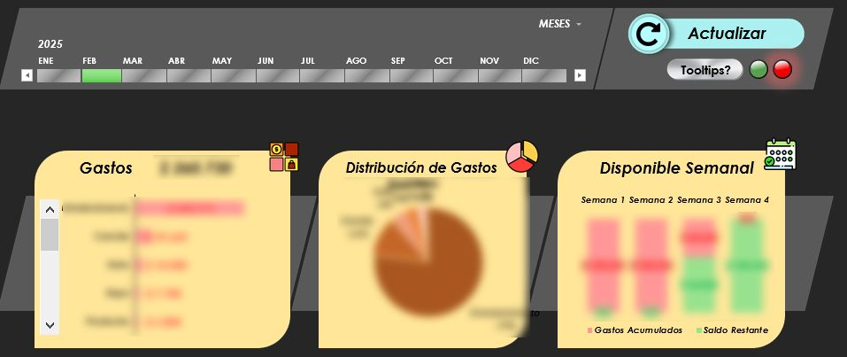
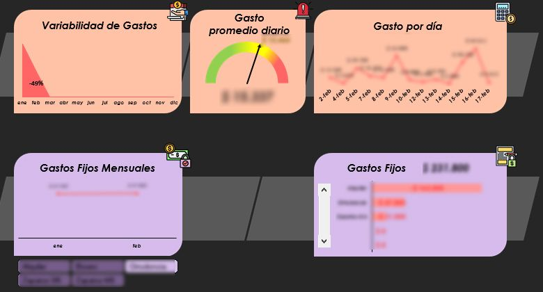

# Finanzas Personales 2025

📊 **Finanzas Personales 2025** está diseñado para ayudarte a organizar y analizar tus ingresos y gastos de manera sencilla y efectiva.  
A través de la hoja **Registros**, podrás ingresar todas tus transacciones diarias, mientras que el **Dashboard** te mostrará un resumen visual con métricas clave para entender tu situación financiera.

---

### ✨ Características principales

- Registrar y organizar todos tus movimientos financieros en un solo lugar.  
- Dashboard dinámico con gráficos e indicadores clave.  
- Análisis de gastos fijos y variables para identificar oportunidades de ahorro.  
- Comparación de ingresos con la inflación para evaluar el poder adquisitivo real.  
- Automatización completa mediante macros y botones interactivos, reduciendo el trabajo manual.  

---

### 📖 Instructivo

El proyecto incluye un documento con instrucciones detalladas para la configuración y uso.  
📄 [Ver instructivo completo](./Instructivo%20-%20Finanzas%20Personales%202025.pdf)

---

### 💾 Descarga

📥 Puedes descargar el archivo Excel desde este repositorio para uso personal o educativo.  
➡️ [Descargar Finanzas Personales 2025.xlsm](./Finanzas%20Personales%202025.xlsm?raw=true)  
Uso personal o educativo — sin fines comerciales.

---

### 🖼 Vista previa

   
   
   
  

---

### ⚙️ Tecnologías utilizadas

- **Microsoft Excel**  
- **VBA (Visual Basic for Applications)**  
- **Tablas dinámicas y fórmulas avanzadas**  
- **Gráficos dinámicos e indicadores personalizados**

---

### 🧾 Licencia

Este proyecto se distribuye bajo la licencia  
**Creative Commons Atribución-NoComercial-SinDerivadas 4.0 Internacional (CC BY-NC-ND 4.0)**  

🔗 [Leer licencia completa](https://creativecommons.org/licenses/by-nc-nd/4.0/deed.es)

---

### 👤 Autor

Desarrollado por **[Bruno Ferri](https://www.linkedin.com/in/brunoferri/)**  

💬 Si lo probás, me interesa conocer tu opinión o sugerencias.  
Puedes dejar un comentario o contactarme para compartir tu feedback.

---

### 🚀 En resumen

**Finanzas Personales 2025** es un archivo Excel con automatizaciones en VBA diseñado para ayudarte a tener un control completo sobre tus finanzas personales.  
Permite registrar ingresos, gastos, reservas y transferencias, y visualizar toda la información en un dashboard intuitivo y automatizado.

📊 Ideal para quienes buscan una herramienta práctica, gratuita y totalmente funcional para gestionar su economía personal.

---
